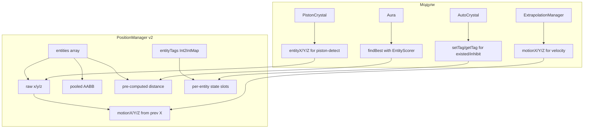

# PositionManager v2 — Архитектурное расширение для покрытия 6 skipped-кейсов

> **Цель:** Расширить [`PositionManager`](src/main/java/bodevelopment/client/blackout/manager/managers/PositionManager.java) так, чтобы все 6 пропущенных модулей могли использовать его кэш.
>
> **Принцип:** Никакого дублирования логики модулей. Только данные. PositionManager = data layer, модули = logic layer.

---

## Анализ корневых причин каждого skipped-кейса

### Кейс 2 — Aura.updateTarget() (scoring-based selection)

| Проблема | Текущий код | Почему не покрыто |
|----------|-------------|-------------------|
| Нужна сортировка по score (Health/Angle/Distance), не просто `findClosest` | 256-элементный ручной массив с scoring-функцией | PositionManager умеет только `findClosest(filter)` — минимальная дистанция |

**Требуется:** `findBest(filter, scorer)` — выбор лучшего по произвольной скоринговой функции, плюс `findTopN(filter, scorer, n)` для multi-target.

---

### Кейс 9 — Blocker.getBlocking()

| Проблема | Текущий код | Почему не покрыто |
|----------|-------------|-------------------|
| Использует `EntityUtils.intersects(BoxUtils.crystalSpawnBox(pos), ...)` | Не итерирует кристаллы напрямую | Это не проблема PositionManager — Blocker просто не делает ручной итерации |

**Вердикт:** НЕ требует расширения PositionManager. Blocker использует `EntityUtils.intersects()` + `BoxUtils.crystalSpawnBox()`, что уже работает через коллизию, а не итерацию.

---

### Кейс 10 — AutoCrystal.canAttack() (state tracking)

| Проблема | Текущий код | Почему не покрыто |
|----------|-------------|-------------------|
| Проверка `this.existedTicksList.contains(pos)`, `this.inhibitList.contains(id)`, `this.attacked.contains(id)` | State хранится в TickTimerList-ах модуля | PositionManager не знает о state-тимерах |

**Требуется:** Generic `int`-теги на каждый entity, с опциональным tick-expiry. Модули могут писать и читать теги через PositionManager вместо своих TickTimerList-ов.

---

### Кейс 11 — AutoMine.getTargetCrystal()

| Проблема | Текущий код | Почему не покрыто |
|----------|-------------|-------------------|
| `crystals.contains(crystal.blockPosition())` — TimerList позиций | Проверка временных меток своих же кристаллов | Позиции кристаллов — это не энтити-атрибут, а модуль-специфичный state |

**Требуется:** `BlockPos`-теги с tick-expiry на каждый entity ID. Аналог TickTimerList, но кэшированный в PositionManager.

---

### Кейс 12 — PistonCrystal.updateAttack()

| Проблема | Текущий код | Почему не покрыто |
|----------|-------------|-------------------|
| `entity.getX() != crystalPos.getX() + 0.5` для детекции сдвинутых поршнем кристаллов | Проверка сырых координат | PositionManager хранит только AABB, не `x/y/z` |

**Требуется:** сырые X/Y/Z в массивах, доступные через `entityX(i)`, `entityY(i)`, `entityZ(i)`.

---

### Кейс 33 — ExtrapolationManager

| Проблема | Текущий код | Почему не покрыто |
|----------|-------------|-------------------|
| Нужны экстраполированные (будущие) AABB через `entity.getBoundingBox().move(...)` | PositionManager даёт AABB текущего тика | Нужен дельта-вектор движения |

**Требуется:** Хранение prevX/prevY/prevZ для вычисления motion (дельта за тик). Метод `motionX(i)`, `motionY(i)`, `motionZ(i)`.

---

## План расширения: PositionManager v2 API

### Новые массивы данных (инициализируются в конструкторе)

```java
// Raw coordinate arrays (для PistonCrystal, ExtrapolationManager)
private final double[] entityX = new double[MAX_ENTITIES];
private final double[] entityY = new double[MAX_ENTITIES];
private final double[] entityZ = new double[MAX_ENTITIES];

// Previous-tick coordinates (для ExtrapolationManager — вычисление motion)
private final double[] prevX = new double[MAX_ENTITIES];
private final double[] prevY = new double[MAX_ENTITIES];
private final double[] prevZ = new double[MAX_ENTITIES];

// Entity tag storage (int tags per entity ID, с tick-expiry)
// Ключ: entityId << 8 | tagSlot (8 слотов на entity)
private final it.unimi.dsi.fastutil.ints.Int2IntOpenHashMap entityTags = new Int2IntOpenHashMap();
private final it.unimi.dsi.fastutil.ints.Int2IntOpenHashMap entityTagExpiry = new Int2IntOpenHashMap();
```

### Новые accessor-методы

```java
// --- Raw coordinates ---
public double entityX(int i) { return entityX[i]; }
public double entityY(int i) { return entityY[i]; }
public double entityZ(int i) { return entityZ[i]; }

// --- Motion (velocity per tick) ---
public double motionX(int i) { return entityX[i] - prevX[i]; }
public double motionY(int i) { return entityY[i] - prevY[i]; }
public double motionZ(int i) { return entityZ[i] - prevZ[i]; }

// --- Entity tags (8 per entity, int value with tick expiration) ---
public void setTag(Entity entity, int slot, int value, int ticks);
public int getTag(Entity entity, int slot);
// Для удобства: auto-slot tag (использует hashCode % 8)
public void setTag(Entity entity, int value, int ticks);
public int getTag(Entity entity);
```

### Новые query-методы

```java
// --- Scoring-based selection (Aura) ---
@FunctionalInterface
public interface EntityScorer {
    double score(Entity entity, AABB box, double distance, int index);
}

public int findBest(Predicate<Entity> filter, EntityScorer scorer);
public int[] findTopN(Predicate<Entity> filter, EntityScorer scorer, int n, int[] out);
```

### Модификация refresh()

В `refresh()` добавляется:
```java
// Сохраняем предыдущие координаты
System.arraycopy(entityX, 0, prevX, 0, count);
System.arraycopy(entityY, 0, prevY, 0, count);
System.arraycopy(entityZ, 0, prevZ, 0, count);

// Заполняем новые
entityX[i] = entity.getX();
entityY[i] = entity.getY();
entityZ[i] = entity.getZ();

// Тикаем entityTagExpiry (на каждый тик уменьшаем на 1, удаляем <= 0)
```

---

## Матрица покрытия skipped-кейсов

| Кейс | Требуемое расширение | Сложность | Профит |
|------|---------------------|-----------|--------|
| 2 — Aura scoring | `findBest()` / `findTopN()` + `EntityScorer` | 🟡 Средняя | -N scoring-аллокаций (сейчас: 256-элементный массив каждый тик) |
| 9 — Blocker | ❌ НЕ требует расширения | — | Blocker не итерирует кристаллы напрямую |
| 10 — AutoCrystal state | `setTag/getTag` + tick-expiry | 🔴 Высокая | Замена TickTimerList на кэшированный Int2IntMap |
| 11 — AutoMine crystal pos | `setTag/getTag` (то же, что и выше) | 🔴 Высокая | Те же теги, но для BlockPos |
| 12 — PistonCrystal coords | `entityX/Y/Z(i)` + предзаполнение в refresh | 🟢 Низкая | -1 `entity.getX()` вызов |
| 33 — ExtrapolationManager | `motionX/Y/Z(i)` + `prevX/Y/Z` | 🟡 Средняя | -1 `entity.getBoundingBox()` вызов |

---

## Рекомендации по приоритету имплементации

### Фаза A — Низкий риск, гарантированный профит (делаем сразу):

1. **`entityX/Y/Z(i)`** + **`motionX/Y/Z(i)`** + **`prevX/Y/Z`**
   - Покрывает: PistonCrystal (№12), ExtrapolationManager (№33)
   - Изменений в refresh(): +6 строк
   - Новых методов: 6 one-liner getter-ов
   - Риск: **нулевой** — чисто data-кэш

### Фаза B — Средний риск, значительный профит (делаем после A):

2. **`findBest(filter, scorer)`** + **`findTopN(filter, scorer, n, array)`**
   - Покрывает: Aura (№2)
   - Изменений в refresh(): 0 строк
   - Новые методы: 2 поисковых метода + `EntityScorer` функциональный интерфейс
   - Риск: **средний** — Aura сложная, требует тестирования scoring-логики

### Фаза C — Высокий риск, требует переосмысления (архитектурный дебат):

3. **`setTag/getTag` с tick-expiry**
   - Покрывает: AutoCrystal (№10), AutoMine (№11)
   - Это **сдвиг архитектуры**: перенос state-менеджмента из модулей в PositionManager
   - Риски:
     - 8 слотов на entity может не хватить (AutoCrystal использует 5+ TickTimerList-ов)
     - Коллизии слотов между модулями
     - Смешение ответственности (data layer vs state layer)
   - Альтернатива: не переносить state, а дать PositionManager только raw data

---

## Диаграмма зависимости данных (Mermaid)



---

## Итог: что реально стоит делать

| Приоритет | Изменение | Трудоёмкость | Профит | Риск |
|-----------|----------|-------------|--------|------|
| 🔥 P0 | `entityX/Y/Z` + `motionX/Y/Z` + `prevX/Y/Z` | 30 мин | Покрывает 2 кейса | 0 |
| 🟡 P1 | `findBest` + `findTopN` | 1 час | Покрывает 1 кейс (Aura) | Средний |
| 🔴 P2 | `setTag/getTag` state storage | ⚠️ Архитектурный дебат | Покрывает 2 кейса | Высокий |
| ➖ Skipped | Blocker | — | Не требует расширения | — |

**Рекомендация:** Имплементируем P0 и P1 (3 расширения, 3 кейса). Для P2 (AutoCrystal/AutoMine state) — оставляем state-менеджмент в модулях, это их зона ответственности.
